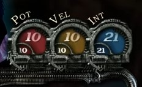

    
    <video style="z-index: -100; position:static"  loop autoplay>
    <source src="../assets/casavelha.mp4" type="video/mp4">
    Your browser does not support playing this Video
    </video>

    
    

<b>Casa Velha RPG</b> é uma comunidade focada no RPG (Role-Playing Games) com o objetivo de socialização, inclusão, diversão e aprimoramento pessoal.

     
 Com os trabalhos iniciados no final do ano de 2016, fundado por Diego Taveira e mais um grupo de pessoas, tinha por foco realizar transmissões de mesas de RPG em plataformas de <i>stream</i> como Twitch e Youtube. Logo que o ainda canal começou seus trabalhos, fui atraído pelo conceito e originalidade do projeto. 

 Começando minha segunda faculdade, estava progurando algo do tipo, e no mesmo ano me juntei a equipe de moderação e inclusive joguei algumas mesas.

 No início de 2017, com a finalidade de unificar os espectadores, criei o Grupo Oficial do canal no Telegram, plataforma de mensagens intantâneas. Ainda nesse ano, deu-se início o desenvolvimento do [website](https://casavelharpg.com.br) e do [fórum](https://casavelharpg.com.br/forum) no qual gerenciei o desenvolvimento juntamente com outros membros da comunidade.

 No final de 2017 lanço um bot para o Grupo do Telegram para ajudar a gerenciar a comunidade. Com o desenvolvimento do bot no telegram, desenvolvo também um bot para o chat do Twitch, no qual era capaz de contabilizar "Rapaduras", moeda virtual utilizada como ferramenta de interação entre os espectadores, e implementar uns jogos no chat da Twitch, além de outras ferramentas de integração. Hoje o bot é integrado com o youtube, devido a comunidade não utilizar os serviços da Twitch, e sua execução primária sendo gerenciada por uma plataforma terceirizada, onde a integração com os serviços principais é feita através de uma API.

 Desenvolvi também ferramentas de integração entre o bot e o sistema de transmissão dos jogos, possibilitando que os jogadores atualizassem informações sem a necessidade de interação com o gerente de transmissão.

 <figure>
	
<figcaption><a><b>Fig.1</b> Sistema que integra as informações de cada jogador no transmissor, sem interação com o gerente de transmissão</a>.</figcaption>
</figure>

Eu pretendo divulgar os códigos dos sistemas no GitHub, porém tenho que gerenciar algumas classes que contém informações sensíveis.

Toda a informação sobre o canal e as mídias sociais você pode encontrar no website.

[www.casavelharpg.com.br](https://casavelharpg.com.br)