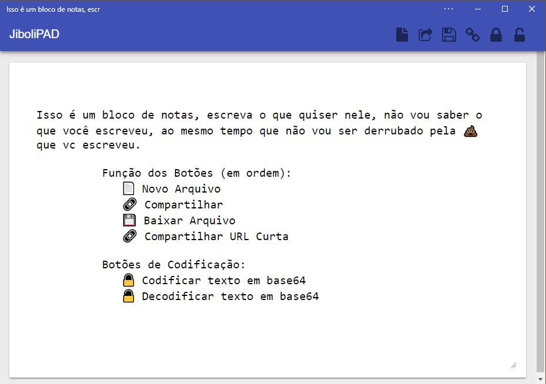

 
    
    

<b>JiboliPAD</b> é uma ferramenta contruída nos padrões PWA (Power Web Apps) que permite o compartilhamento de textos de forma segura entre duas pessoas, não salva nenhuma informação e nenhum arquivo. Inclusiva roda diretamente do GitHub Pages, seu código é aberto.

     
<a class="github-button" href="https://github.com/jiboli/jibolipad" data-icon="octicon-star" data-size="large" aria-label="Star jiboli/jibolipad on GitHub">Star</a>
